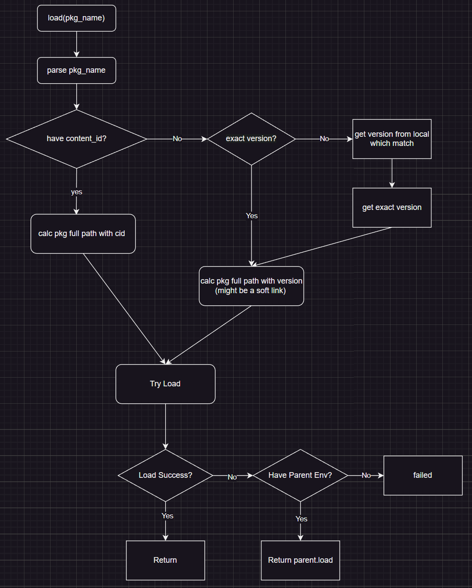
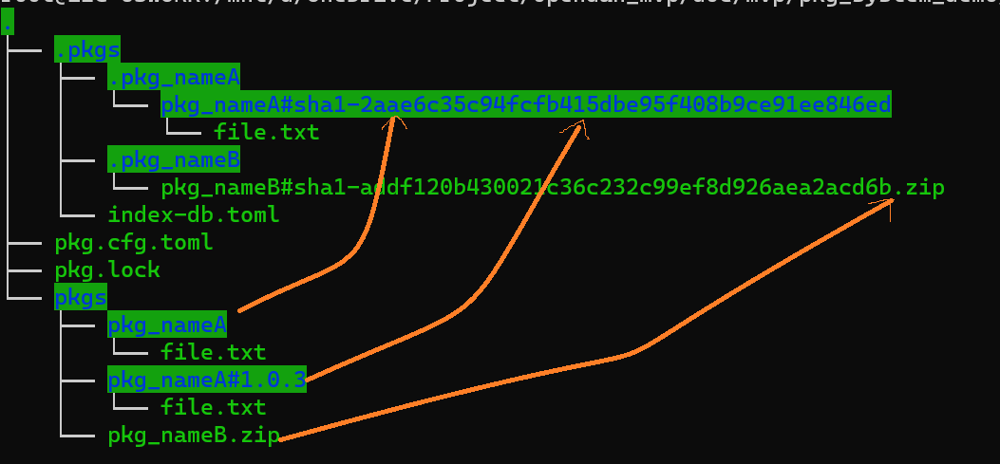

# Problems to Solve
The Package Manager is a fundamental component of the system for managing Packages.
The sub system provides fundamental support for packaging, publishing, downloading, verifying, installing, and loading folders containing required packages under different scenarios. Based on relevant modules, it's easy to build a package management system similar to `apt/pip/npm`.

The system design has deeply referenced Git and NDN networks. The distinction between client and server is not that important. Through cryptography, it achieves decentralized trustworthy verification. Any client can become an effective repo server through simple configuration.


# Design
Let's start by introducing the two important processes.
## Load Package
[](pkg_procedure.drawio)

## Install Package
[](pkg_procedure.drawio)

注意安装的依赖检测流程，按照流程允许将确实的package安装到当前env

# Some Basic Concepts
- ***env***:A target environment consisting of a series of configuration files, where packages can be loaded/installed.
- ***pkg***:A Package(pkg) is either a folder or a file that serves the same purpose as a folder (such as zip, iso, etc.).
- ***pkg_name***:A unique string used to label a package. It's usually a readable package name, but can also include the version number or even the ContentId.
- ***version_id***:A complete version number is made up of channel_name and version. channel_name is generally not specified and is configured uniformly by the env (e.g., all use the `nightly` channel or all use the `release` channel). Version_ids are divided into exact versions and conditional versions.
- ***mediainfo***:A recognizable file or folder format. Successfully loading a package means obtaining a confirmed MediaInfo, from which the package's content can be further read.
- ***Author***: The package's author, which includes the author's friendly name (unique) and public key. This system cannot determine the trustworthiness of the relationship between the friendly name and the public key; upper layers need to extend this based on product design. Verification through DNS systems or smart contracts is common.
- ***Distributor***:The distributor is responsible for maintaining index_db.
- ***index_db***:A database containing a series of package information (pkg_info), maintained by the distributor. `index_db` is a complete file saved within the env. It is updated through the index_db update operation in the env from the distributor. Since -pkg_info contains the package's cid info and the corresponding author's signature, the distributor can only select the version released by the author and cannot release packages on behalf of the Author.
- ***repo_server***:Includes pkg_server and index_db_server, which can be deployed separately.
- ***ndn_client***: A library for trustworthy downloading of packages through the package's ContentId.

# Package Env Directory Structure
[]()

The diagram represents a typical pkg_env directory structure, where:

- ***pkg.cfg.toml*** The root directory contains a pkg.cfg.toml file, which is the main configuration file for the environment.
- ***index-db*** Inside pkg.cfg.toml, there are two external files included: an external pkg.lock (local version locking) and .pkgs/index-db.toml (independently distributed package index by the distributor).
- ***.pkgs*** Similar to .git, this folder contains a series of files and directories not directly used by users but supporting package management. It stores all different versions of packages using the naming convention $.pkg_name/pkg_name#cid.
- ***pkgs*** This directory is user-facing, structured according to successful package installations. Installed packages are soft-linked to the actual files/directories under the .pkgs folder. This minimizes redundant file copying and makes it convenient for users to view and modify. In this example, pkg_nameA has two versions (the default version and 1.0.3), both pointing to the actual folders with CIDs in .pkgs.


During the local testing phase, users can easily place their own packages in the pkgs directory for successful loading. Any local changes will not affect the content of the index-db, nor will it impact testing. Cryptographic verification only occurs during the download and installation process.

The above environment isolation design also provides a fairly standard solution for common dependency conflicts.

# Test


## Load Package Test
Load testing some times not depend on index-db.
### Loading Using pkg_id
This is the simplest mode for users.
Not specifying a version number usually means using the default version. When an index exists, the default version is fetched from the index.
In the absence of an index, the default version will prioritize links without suffixes; otherwise, it will use the link with the highest version.
```python 
load("english-dict")
```
Actual load:
```
./pkgs/english-dict/
./pkgs/english-dict#0.1.5/
```

When there's an index-db, it will determine the default version based on the index-db information and load using the directory name with the version:
```
./pkgs/english-dict#0.1.3/
```
Note that even when there's an index-db with a cid, the system still primarily loads by symbol. This gives system administrators more flexibility. Try to avoid modifying directories named with cids.


### Loading Using pkg_id + cid
```python
load("english-dict#sha256:1234567890")
```

This is the simplest method and doesn't rely on index-db. The system can precisely locate and load the package, which is stored in:
```
./.pkgs/english-dict/sha256:1234567890/
```

Verification of media information does not occur before loading; it only takes place after the download is complete.

### 
The channel is part of the version. If it's not specified, the default channel name will be read from the environment.
If the version number is fixed, the directory is directly constructed for loading. If the version number is conditional, it depends on the locally installed version list to first determine the version, and then constructs the directory for loading.
```python 
load("english-dict#>0.1.4")
```
The package will be loaded based on the actual version installed locally:
```
./pkgs/english-dict#0.1.5/
```
Automatic local repair logic for loading using an exact version number:
At this point, if that directory does not exist, but it can be seen from the index-db that the cid corresponding to version 0.1.5 is already installed locally, loading will fail by default (simply deleting the version link effectively blocks a version).

Only when the option to automatically repair links during loading is enabled (which requires permissions), will it automatically create a link to that cid directory and successfully load.
#### Version Control 
Support Only 4 Comparison Operators: >, <, >=, <=

- ***>0.1.2***: Any version greater than 0.1.2
- ***>0.1.2<0.1.5***: Any version greater than 0.1.2 and less than 0.1.5
- ***<0.1.2***: Any version less than 0.1.2

The logic for version selection during load is as follows:

1. Retrieve all locally installed versions.
2. Based on the version selection criteria, choose one version.

Note that during installation, the version chosen based on dependency information has its selection set from all versions in index-db, and it is not related to the versions already installed locally.


## Package Installation Testing (To Be Completed)
Installation testing depends on index-db.

### Installing Using pkg_id
Check if the installed result matches the current version specified in index-db.

### Installing Using pkg_id + cid
Verify that the installation process correctly validates the cid. After successful installation, making simple changes to the files on the server should result in a download verification failure.

### Installing Using pkg_id + Version Constraints
Check if the installed result matches the correct version specified in index-db.

### Installation with Local Upgrades
After installing using the pkg_id method, make changes to the package content, then reinstall. At this point, the locally modified version should be backed up, and the current version should be reinstalled.